# PurrfectCare Manager

PurrfectCare Manager to aplikacja webowa do zarządzania kotami i planowania opieki: aktywności, terminarz, logi wykonania oraz przypisywanie opiekunów.

Projekt jest zbudowany jako proste MVC + podział Frontend/Backend:
- **Frontend**: statyczne widoki HTML + CSS + JavaScript (FETCH API)
- **Backend**: PHP 8 (OOP) + PostgreSQL
- **Uruchomienie**: Docker (nginx + php-fpm + postgres + pgAdmin)

## Funkcje

- logowanie / rejestracja / wylogowanie (sesja użytkownika)
- panel użytkownika: profil, zmiana danych / hasła, avatar
- koty: tworzenie / edycja / usuwanie, szczegóły, galeria zdjęć
- aktywności: planowanie i oznaczanie wykonania
- logi: historia wykonanych czynności
- opiekunowie: relacja kot ↔ opiekun (many-to-many)
- panel admina: statystyki i zarządzanie użytkownikami (rola, blokada)

## Technologie

- Docker + docker-compose
- PHP (OOP) + nginx + php-fpm
- PostgreSQL + (opcjonalnie) pgAdmin
- HTML5 + CSS (responsywność przez media queries)
- JavaScript + FETCH API (AJAX)

## Uruchomienie

Wymagania: Docker Desktop.

Start:

```bash
docker compose up -d --build
```

Adresy:
- aplikacja: http://localhost:8080
- pgAdmin: http://localhost:5050

PostgreSQL:
- host: `localhost`
- port: `5433`
- db: `cats_db`
- user: `docker`
- password: `docker`

pgAdmin:
- email: `admin@example.com`
- hasło: `admin`

## Reset bazy (usuń wolumen pg-data)

Najprościej:

```bash
docker compose down -v
docker compose up -d --build
```

Jeśli chcesz usunąć tylko wolumen ręcznie:

```bash
docker compose down
docker volume rm wdpai_pg-data
docker compose up -d --build
```

Uwaga: nazwa wolumenu zwykle ma prefix projektu (`wdpai_pg-data`). Sprawdź w `docker volume ls`.

## Architektura (krótko)

- `index.php` startuje sesję i uruchamia routing.
- `Routing.php` mapuje URL → kontroler (HTML lub API JSON).
- Kontrolery w `src/controllers/` korzystają z `src/Database.php` (PDO) i warstw pomocniczych (`Validator`, `ErrorHandler`).
- Frontend to `public/views` + `public/scripts` (moduły JS z jednym wrapperem `fetch`).

## Konfiguracja środowiska (.env.example)

- `POSTGRES_DB/USER/PASSWORD` – dane startowe Postgresa (kontener `db`).
- `APP_PORT/DB_PORT/PGADMIN_PORT` – porty wystawione na hosta.
- `PGADMIN_DEFAULT_EMAIL/PASSWORD` – login do pgAdmin.

Uwaga: aplikacja (PDO) ma teraz host/user/pass „na sztywno” w `src/Database.php` (host `db`, baza `cats_db`, user `docker`).

## Konta demo

W init bazy (`docker/db/init.sql`) są dodane 3 konta (hasła są zapisane jako hash bcrypt):

- `admin` / `admin@example.com` / `Admin123!` – rola `admin`
- `user1` / `user1@example.com` / `User123!` – rola `user`
- `testowy` / `testowy@example.com` / `Testowy123!` – rola `user`

## Struktura projektu (tree)

```text
wdpai/
├── docker-compose.yaml
├── index.php
├── Routing.php
├── docker/
│   ├── db/
│   │   ├── Dockerfile
│   │   └── init.sql
│   ├── nginx/
│   │   ├── Dockerfile
│   │   └── nginx.conf
│   └── php/
│       └── Dockerfile
├── public/
│   ├── views/
│   ├── scripts/
│   ├── styles/
│   └── uploads/
└── src/
    ├── Database.php
    ├── ErrorHandler.php
    ├── Http/
    │   ├── Request.php
    │   └── Response.php
    ├── controllers/
    ├── models/
    ├── repository/
    └── utils/
```

## Opis plików

- `index.php` – start sesji i uruchomienie routera
- `Routing.php` – routing URL → kontroler/metoda lub widok HTML + podstawowa ochrona stron
- `docker/db/init.sql` – schemat bazy + dane startowe + obiekty SQL (widoki/funkcja/trigger)
- `src/Database.php` – połączenie do PostgreSQL przez PDO
- `src/Http/Request.php` – pobieranie danych z `$_GET/$_POST/$_SERVER`
- `src/Http/Response.php` – odpowiedzi: redirect/json/text/view
- `src/controllers/` – kontrolery HTML + API JSON
- `public/views/` – widoki HTML
- `public/scripts/` – JavaScript (Fetch API)
- `public/styles/` – style CSS
- `public/uploads/` – uploady (avatary/zdjęcia)

## Baza danych

Źródło schematu i danych startowych: `docker/db/init.sql`.

Najważniejsze tabele: `users`, `cats`, `cat_caregivers`, `activities`, `logs`, `cat_photos`.

Zaimplementowane obiekty SQL (w init.sql):

- widoki: `vw_activity_details`, `vw_cat_overview`
- funkcja: `fn_assign_caregiver(p_cat_id UUID, p_user_id UUID)`
- trigger: `trg_set_updated_at()` + triggery `set_updated_at_*`

## ERD (diagram)

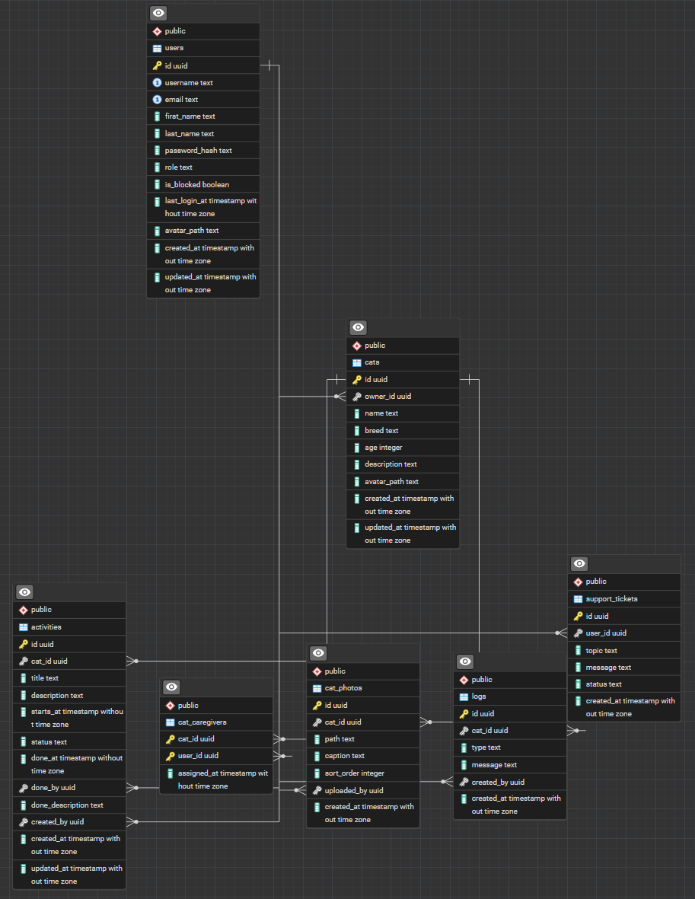

Tabele i relacje (krótko):

- `users` – użytkownicy (role: `admin/user`, blokada, avatar).
- `cats` – koty; relacja 1:N `users(id)` → `cats(owner_id)` (właściciel).
- `cat_photos` – zdjęcia; relacja 1:N `cats(id)` → `cat_photos(cat_id)` (kasuje się kaskadowo).
- `activities` – aktywności; relacja 1:N `cats(id)` → `activities(cat_id)` + opcjonalnie `done_by/created_by` → `users(id)`.
- `logs` – logi; relacja 1:N `cats(id)` → `logs(cat_id)` + opcjonalnie `created_by` → `users(id)`.
- `cat_caregivers` – tabela łącząca M:N `cats` ↔ `users` (PK: `(cat_id, user_id)`).
- `support_tickets` – zgłoszenia; opcjonalnie `user_id` → `users(id)`.

## Funkcje / widoki / triggery (SQL)

- Widoki: `vw_activity_details` (JOIN aktywności+kot+użytkownicy) i `vw_cat_overview` (kot + owner + liczniki).
- Funkcja: `fn_assign_caregiver(cat_id, user_id)` dodaje opiekuna do kota (bez duplikatów).
- Trigger: `trg_set_updated_at()` automatycznie ustawia `updated_at` przy UPDATE.
- Trigger: `format_imion_nazwisk()` poprawia zapis imienia/nazwiska (`INITCAP`) przy INSERT/UPDATE.

## Transakcje i poziom izolacji

- Transakcje (PDO): usuwanie użytkownika + danych powiązanych (`adminUserDelete`) i reorder zdjęć (`reorderCatPhotos`) w `src/controllers/ApiController.php`; aktualizacja konta (`updateAccount`) w `src/controllers/SecurityController.php`.
- Transakcje (SQL): migracje z `BEGIN/COMMIT` w `docker/db/migrations/*.sql`.
- Poziom izolacji: nie jest ustawiany ręcznie, więc działa domyślny PostgreSQL: `READ COMMITTED`.

## Wzorce (prosto)

- **MVC**: kontroler (`src/controllers/*`) wybiera widok (`public/views/*`) i pracuje na modelu/DB.
- **Repository**: `src/repository/UserRepository.php` ukrywa SQL dla użytkowników.
- **Front Controller**: `index.php` jest jednym wejściem do aplikacji.
- **DRY/Utility**: `src/utils/Validator.php` trzyma wspólną walidację.

## Screenshots

Rejestracja użytkownika (formularz + walidacja po stronie serwera).
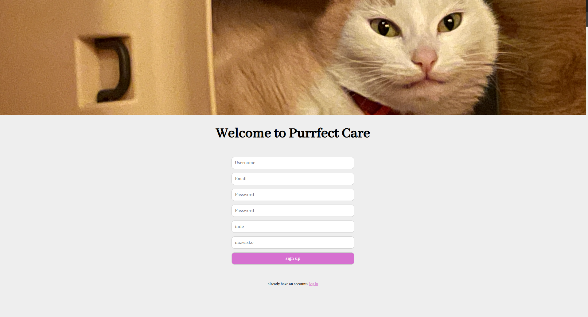

Dashboard po zalogowaniu (podsumowanie i szybkie akcje).
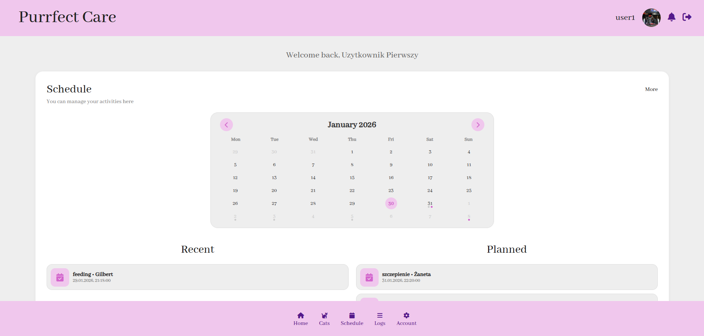

Lista kotów z podstawowymi danymi i dostępami (właściciel/opiekun).


Szczegóły kota (opis, informacje, sekcje szczegółowe).
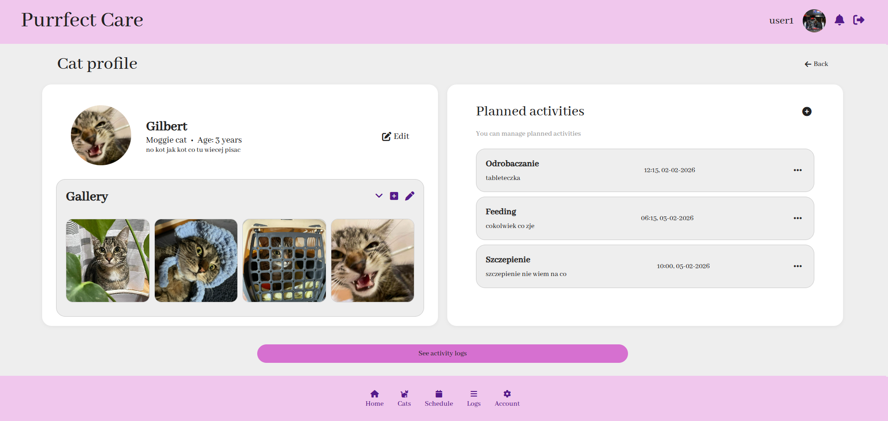

Modal edycji kota (zmiana danych bez przeładowania strony).
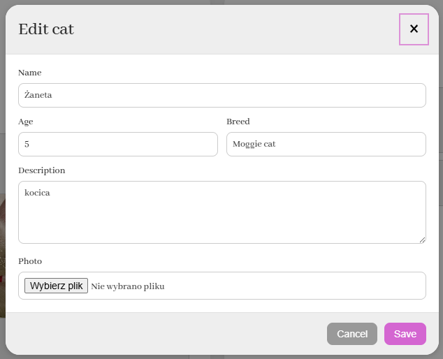

Harmonogram/aktywności (planowanie i przegląd zadań).
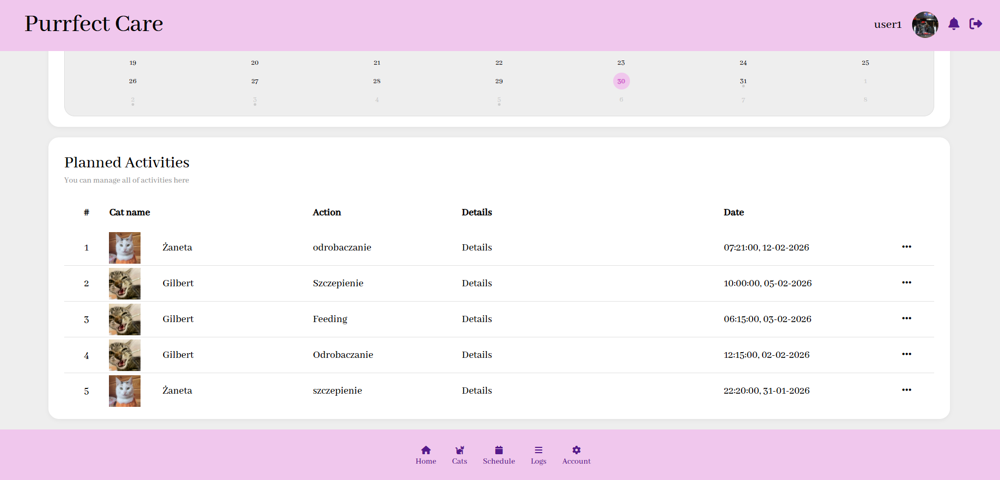

Zarządzanie opiekunami kota (przypisywanie i usuwanie relacji).
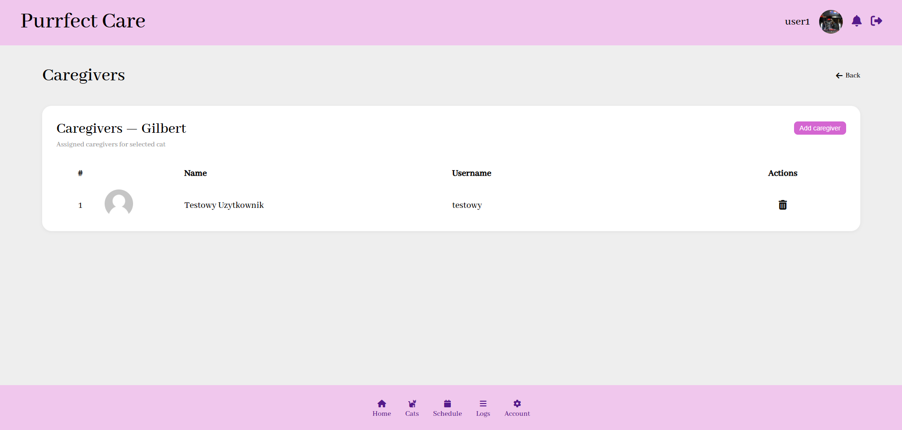

Ustawienia użytkownika/aplikacji (profil, hasło, preferencje).
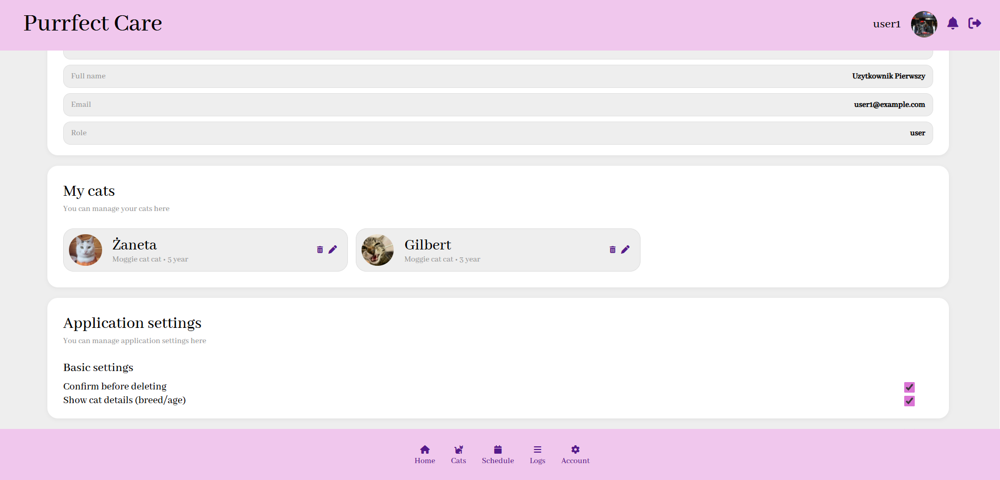

Strona błędu 404 (obsługa nieistniejących ścieżek).
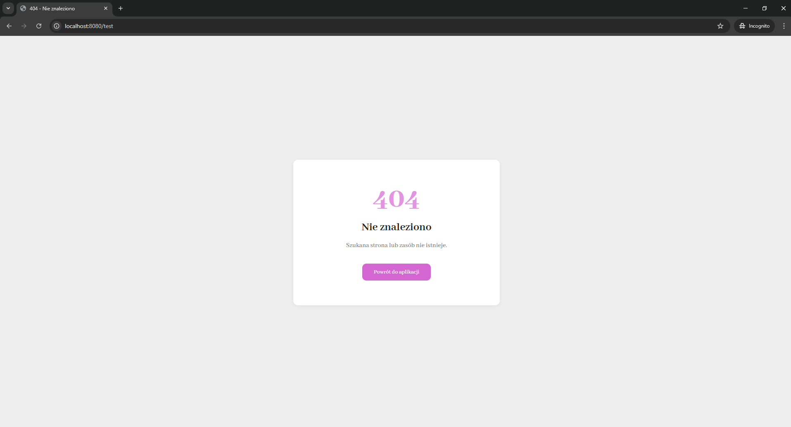

Modal edycji użytkownika w panelu admina (rola, blokada, hasło).
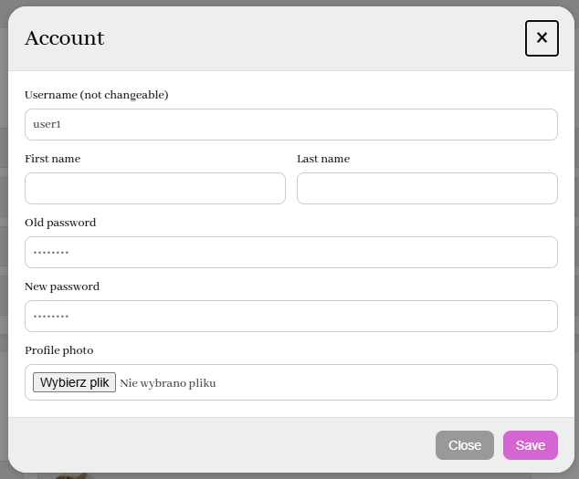

Panel administratora (statystyki i zarządzanie użytkownikami).
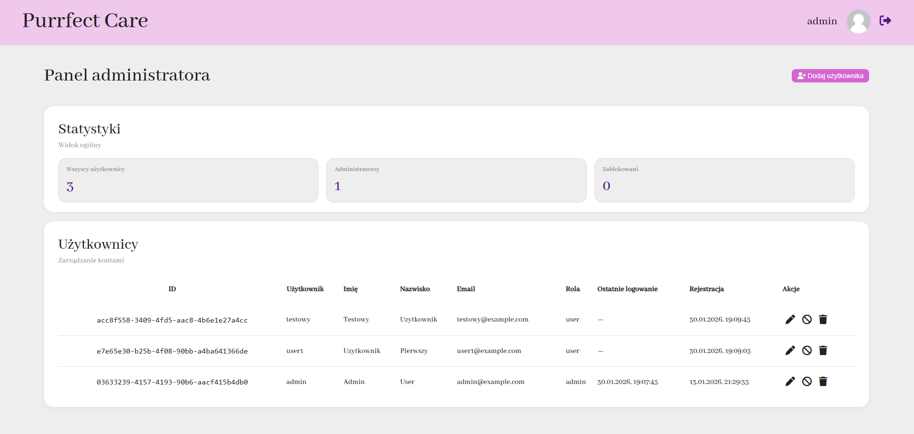
