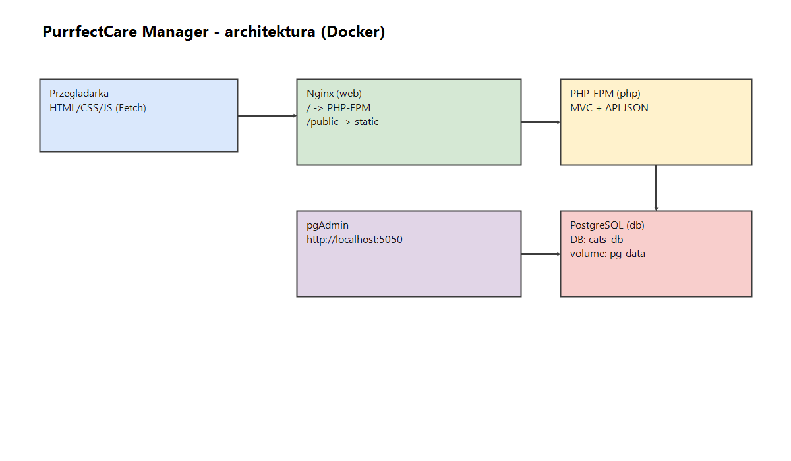

# PurrfectCare Manager

PurrfectCare Manager to aplikacja webowa do zarządzania kotami i planowania opieki: aktywności, terminarz, logi wykonania oraz przypisywanie opiekunów.

Projekt jest zbudowany jako proste MVC + podział Frontend/Backend:
- **Frontend**: statyczne widoki HTML + CSS + JavaScript (FETCH API)
- **Backend**: PHP 8 (OOP) + PostgreSQL
- **Uruchomienie**: Docker (nginx + php-fpm + postgres + pgAdmin)

## Funkcje

- logowanie / rejestracja / wylogowanie (sesja użytkownika)
- panel użytkownika: profil, zmiana danych / hasła, avatar
- koty: tworzenie / edycja / usuwanie, szczegóły, galeria zdjęć
- aktywności: planowanie i oznaczanie wykonania
- logi: historia wykonanych czynności
- opiekunowie: relacja kot ↔ opiekun (many-to-many)
- panel admina: statystyki i zarządzanie użytkownikami (rola, blokada)

## Technologie

- Docker + docker-compose
- PHP (OOP) + nginx + php-fpm
- PostgreSQL + (opcjonalnie) pgAdmin
- HTML5 + CSS (responsywność przez media queries)
- JavaScript + FETCH API (AJAX)

## Uruchomienie

Wymagania: Docker Desktop.

Start:

```bash
docker compose up -d --build
```

Adresy:
- aplikacja: http://localhost:8080
- pgAdmin: http://localhost:5050

PostgreSQL:
- host: `localhost`
- port: `5433`
- db: `cats_db`
- user: `docker`
- password: `docker`

pgAdmin:
- email: `admin@example.com`
- hasło: `admin`

## Reset bazy (usuń wolumen pg-data)

Najprościej:

```bash
docker compose down -v
docker compose up -d --build
```

Jeśli chcesz usunąć tylko wolumen ręcznie:

```bash
docker compose down
docker volume rm wdpai_pg-data
docker compose up -d --build
```

Uwaga: nazwa wolumenu zwykle ma prefix projektu (`wdpai_pg-data`). Sprawdź w `docker volume ls`.

## Architektura

- źródło: `docs/architecture.drawio`
- podgląd: `docs/architecture.png`



## Konfiguracja (.env)

Przykładowe wartości: `.env.example` (DB/porty/pgAdmin).

## Konta demo

W init bazy (`docker/db/init.sql`) są dodane przykładowe konta:

- admin: `admin@example.com`
- user: `user1@example.com`

Hasła są zapisane jako hash w SQL, więc do demo najprościej: zarejestrować nowe konto lub ustawić hasło ręcznie w bazie.

## Struktura projektu (tree)

```text
wdpai/
├── docker-compose.yaml
├── index.php
├── Routing.php
├── docker/
│   ├── db/
│   │   ├── Dockerfile
│   │   └── init.sql
│   ├── nginx/
│   │   ├── Dockerfile
│   │   └── nginx.conf
│   └── php/
│       └── Dockerfile
├── public/
│   ├── views/
│   ├── scripts/
│   ├── styles/
│   └── uploads/
└── src/
    ├── Database.php
    ├── ErrorHandler.php
    ├── Http/
    │   ├── Request.php
    │   └── Response.php
    ├── controllers/
    ├── models/
    ├── repository/
    └── utils/
```

## Opis plików

- `index.php` – start sesji i uruchomienie routera
- `Routing.php` – routing URL → kontroler/metoda lub widok HTML + podstawowa ochrona stron
- `docker/db/init.sql` – schemat bazy + dane startowe + obiekty SQL (widoki/funkcja/trigger)
- `src/Database.php` – połączenie do PostgreSQL przez PDO
- `src/Http/Request.php` – pobieranie danych z `$_GET/$_POST/$_SERVER`
- `src/Http/Response.php` – odpowiedzi: redirect/json/text/view
- `src/controllers/` – kontrolery HTML + API JSON
- `public/views/` – widoki HTML
- `public/scripts/` – JavaScript (Fetch API)
- `public/styles/` – style CSS
- `public/uploads/` – uploady (avatary/zdjęcia)

## Baza danych

Źródło schematu i danych startowych: `docker/db/init.sql`.

Najważniejsze tabele: `users`, `cats`, `cat_caregivers`, `activities`, `logs`, `cat_photos`.

Zaimplementowane obiekty SQL (w init.sql):

- widoki: `vw_activity_details`, `vw_cat_overview`
- funkcja: `fn_assign_caregiver(p_cat_id UUID, p_user_id UUID)`
- trigger: `trg_set_updated_at()` + triggery `set_updated_at_*`

## Screenshoty

logowanie, dashboard, koty/szczegóły, terminarz, admin

## Checklist

Szybkie odhaczenie zgodności z kryteriami:

- [x] Docker + docker-compose
- [x] PostgreSQL
- [x] PHP (OOP) + MVC
- [x] HTML + CSS + JS (FETCH)
- [x] logowanie + sesja + wylogowanie
- [x] role min. 2 (admin/user)
- [x] relacje 1:N i M:N w bazie
- [x] relacja 1:1 w bazie (wymaganie)
- [x] min. 2 widoki w SQL
- [x] min. 1 trigger w SQL
- [x] min. 1 funkcja w SQL
- [ ] transakcje + poziom izolacji (udokumentowane)
- [ ] export kompletnej bazy do pliku .sql (z danymi)
- [ ] ERD (PNG/SVG) + źródło (drawio)
- [x] globalne strony błędów 400/403/404/500
